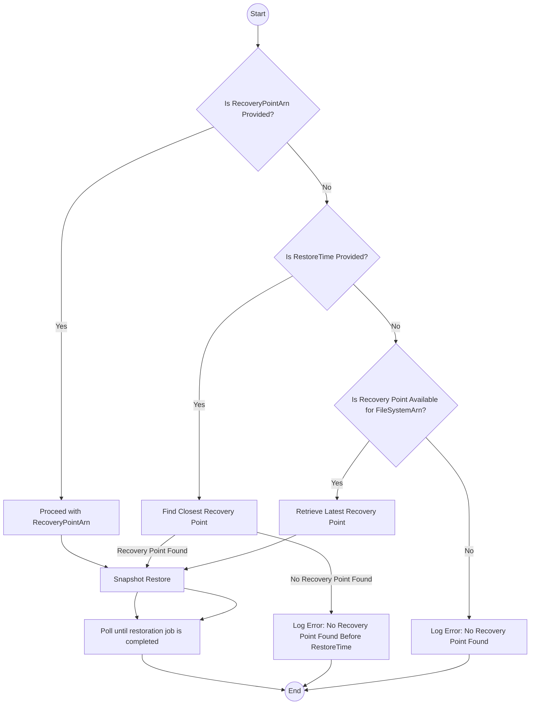

**EFS Restoration from AWS Backup - End User Documentation**

## Overview
This document outlines the process and components involved in restoring an Amazon Elastic File System (EFS) using AWS Backup. The restoration includes restoring policies and tags from the source EFS, with an option to specify a new name for the restored EFS. This workflow ensures secure and reliable recovery of EFS data while preserving resource configurations.

---

## Resources Created
Upon successful execution of the EFS restoration workflow, the following resources will be created:

- **Restored EFS File System:** A new EFS resource restored from the specified recovery point.
- **Tags:** Tags from the source EFS will be copied to the restored EFS.
- **File System Policy:** The source EFS policy will be applied to the restored EFS.
- **Metrics Logs:** Restoration metrics and details will be logged for audit and reporting purposes.

---

## Runbook Inputs and Parameter Combinations
The workflow requires specific inputs that determine the restoration behavior. Below are the primary input parameters:

| **Parameter Name**          | **Parameter Description**                                           | **Required** |
|-----------------------------|---------------------------------------------------------------------|-----------------------|
| `RecoveryPointArn`          | ARN of the recovery point to restore from.                         | Maybe                   |
| `SourceEfsFileSystemArn`    | ARN of the source EFS file system.                                | Yes                  |
| `RestoreTime`               | Specifies the desired restore time.                               | Maybe                   |
| `FileSystemID`              | ID of the file system to be restored.                            | Yes                  |
| `NewFileSystemName`         | Specifies a new name for the restored EFS.                       | Yes                  |
| `KmsKeyId`                  | Specifies the KMS key for encryption.                           | Yes                  |

### Example Input Combinations:
1. **Using a Specified Recovery Point ARN**:
   ```json
   {
     "RecoveryPointArn": "arn:aws:backup:us-east-1:123456789012:recovery-point/abc123",
     "SourceEfsFileSystemArn": "arn:aws:elasticfilesystem:us-east-1:123456789012:file-system/fs-12345",
     "FileSystemID": "fs-12345",
     "NewFileSystemName": "RestoredEFS1",
     "KmsKeyId": "arn:aws:kms:us-east-1:123456789012:key/abcd1234"
   }
   ```
   **Behavior**: Uses the specified `RecoveryPointArn` directly for restoration.

2. **Using Latest Recovery Point for the Provided File System ARN**:
   ```json
   {
     "SourceEfsFileSystemArn": "arn:aws:elasticfilesystem:us-east-1:123456789012:file-system/fs-12345",
     "FileSystemID": "fs-12345",
     "NewFileSystemName": "RestoredEFS2",
     "KmsKeyId": "arn:aws:kms:us-east-1:123456789012:key/abcd1234"
   }
   ```
   **Behavior**: Retrieves the latest recovery point for the specified `SourceEfsFileSystemArn` and initiates restoration.

3. **Restore with Specific Time and FileSystem ID**:
   ```json
   {
     "SourceEfsFileSystemArn": "arn:aws:elasticfilesystem:us-east-1:123456789012:file-system/fs-12345",
     "RestoreTime": "2024-01-01T00:00:00Z",
     "FileSystemID": "fs-12345",
     "NewFileSystemName": "RestoredEFS3",
     "KmsKeyId": "arn:aws:kms:us-east-1:123456789012:key/abcd1234"
   }
   ```
   **Behavior**: Finds the closest recovery point before the specified `RestoreTime` and restores it.

---

## Explanation of Main Components

### 1. **restore_efs**
   - Initiates the restore process based on the following conditions:
     - If `RecoveryPointArn` is provided, it is used directly.
     - If `RecoveryPointArn` is not provided but `SourceEfsFileSystemArn` is, the latest available recovery point is retrieved.
     - If `RestoreTime` is provided along with `SourceEfsFileSystemArn`, the closest recovery point before the specified time is used.

### 2. **poll_restore_status**
   - Polls AWS Backup to check the progress of the ongoing restoration job.

### 3. **check_restore_status**
   - Evaluates the restoration job status and determines whether it has completed successfully or failed.

### 4. **wait_between_aws_backup_polls**
   - Introduces a delay between polling cycles to avoid excessive API calls.

### 5. **get_restored_file_system_id**
   - Retrieves the ID of the newly restored EFS using the creation token.

### 6. **copy_recovery_tags_to_restored_resource**
   - Copies tags from the recovery point to the restored EFS.

### 7. **copy_file_system_policy**
   - Copies the file system policy from the source EFS to the restored EFS.

### 8. **log_metrics**
   - Logs restoration metrics, including file size and timestamps.

### 9. **recovery_succeeded_message**
   - Prints a success message if the restoration completes successfully.

### 10. **recovery_failed_message**
   - Prints a failure message if the restoration fails.

---


**DISCLAIMER:**

This runbook facilitates the restoration of an Amazon Elastic File System (EFS) from AWS Backup recovery points. While the process attempts to replicate core metadata and configurations from the source file system, certain limitations exist:

### Limitations:
- **Incomplete Metadata Restoration:**
   - EFS snapshots capture file system data, file permissions, encryption settings, and file system policies.
   - **Network configurations** (such as mount targets, subnets, and security groups) are not captured in the snapshot and must be manually reconfigured.
   - **File-level permissions and ownership** (POSIX) are included in the snapshot but may require validation post-restoration.

### Usage Considerations:
- This script is provided for **educational** and **operational** use with AWS Backup services.
- Ensure proper validation and testing in a **non-production** environment before applying in production.
- The user assumes responsibility for ensuring the integrity of restored data.

### Security and Liability:
- Ensure appropriate **IAM permissions** are granted to execute the restoration workflow.
- **KMS Keys** used for encryption must be verified to avoid data access issues.
- The authors and contributors disclaim any liability for:
   - Data loss or corruption.
   - Service disruptions or compliance failures.
   - Financial or operational impacts resulting from using this code.

By using this script, you acknowledge and agree to these terms and accept full responsibility for its use in your AWS environment.
